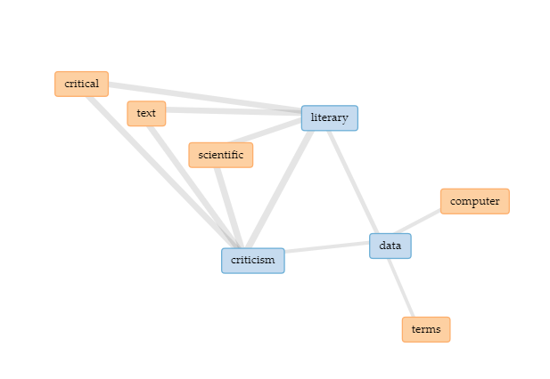

Ramsay and Drucker’s critique of Moretti is incorrect. They argue that Moretti treats his dataset as given, a priori, and unquestionable, rather than information whose metrics and values are open to question. This is a mistake. Digital Humanities methods must rely upon stable, unquestionable datasets because this is the only way that scholarship in the field can scale up. By examining established datasets in unique ways, digital humanities scholarship can advance provable claims about cultural phenomena over large scales of time and space. We must not question the assumptions used to generate datasets because scholarship requires valid data in order to answer big questions.

As a student I find it hard to find suitable datasets for study. This is mainly due to the large amounts of information and datasets that once read and analysed leave you without answering the question you had in mind. These works along with others that are formed solely of personal opinions with no data or facts to back them. They are extremely unreliable when searching for material to use. In Andrew Goldstone’s “Teaching Quantitative Methods: What Makes It Hard (in Literary Studies)” he explains that “the best data for teaching are not to be found by taking all of the bulk releases from big digital archives. Rather, what students need are data about which at least some answers have already been given, so that instead of being forced to fish for interesting phenomena in an empty ocean, students can follow a trajectory from exploration to valid argument.”(Goldstone, 2019) In my opinion, it is unjust to just let people create their own answers when going through digital archives in search for data. I agree with Goldstone’s opinion on needing to lead people to find the answers they are looking for. 

Throughout Moretti's paper, “Graphs, Maps, Trees”, he uses visual forms such as graphs, maps and trees in order to present the data he collected on the cultural shift. These visuals are all forms of stable, reliable and unquestionable datasets that can be used in order to answer big questions. The visuals in Moretti’s work were used to compare things like publication dates, genres and popularity of different novels around the world. In my opinion, representations of data, whether it be through graphs, charts or statistics, is a lot more valuable than opinion based conclusions made by scholars that don't have data to back their thoughts. However, Stephen Ramsay seems to believe that information such as criticism can also be used as a form of suitable data. He feels as though having questions left without answers lets the readers interpret the meanings for themselves. Ramsay compares Moretty to Gottschall by saying that even though they have different outlooks on literary study they both show strong evidence of embracing that “only the methodologies of science and the rigor of computation can render unexamined assumptions "falsifiable.".” He carries on by quoting Gottschall who said that “quantitative data are useful because they are independent of interpretation”. Ramsay believes that even though data is presented it should still be open to interpretation.

Voyant representation of Ramsay’s Reading Machine.

In Ramsay’s paper, “Reading Machines”, there is a strong relation between the words: literary, criticism and data. This is mainly because Ramsay believes that criticism can be used as a critical form of data when dealing with information such as literary texts. However, if we were to take criticism and opinions as viable sources of data it would defy the goal of any study that wants to answer a specific question. At times criticism and opinions can carry over bias and prejudices towards certain subjects. Depending on the study, this can ruin the data collected. For instance, if a study on hard subjects such as religion or politics where to take in considerations opinions as data in order to answer a question based on facts then the answers may be hindered by the answers of the “data” collected. 

Johanna Drucker also believes that all data, factual and opinion based, are valid sources of information. However, she classified all information into two seperate groups known as data and capta. “Capta is “taken” actively while data is assumed to be a “given” able to be recorded and observed.”(Drucker, 2011). In this case, facts and statistics that have been recorded and stored into a dataset would be classified under as capta, where as opinion based information would be data. Although in some cases opinion based information can be useful, it should not be a valid source to use in order to base answers to important questions in the field of digital humanities. Which is why I believe that digital Humanities methods must rely upon stable, unquestionable datasets because this is the only way that scholarship in the field can scale up in the future.

Goldstone, A. (2019). Debates in the Digital Humanities 2019: PART III ][ Chapter 19. Retrieved from https://dhdebates.gc.cuny.edu/read/untitled-f2acf72c-a469-49d8-be35-67f9ac1e3a60/section/620caf9f-08a8-485e-a496-51400296ebcd#ch19

Drucker, J. (2011). Humanities Approaches to Graphical Display. Retrieved from http://www.digitalhumanities.org/dhq/vol/5/1/000091/000091.html

Moretti, F. (2003). GRAPHS, MAPS, TREES. Retrieved from http://www.mat.ucsb.edu/~g.legrady/academic/courses/09w259/Moretti_graphs.pdf

Ramsay, S. (20011).Reading Machine. Retrieved from 
http://sites.uci.edu/digitalhumanitiesreadinggroup/files/2016/02/stephen-ramsay-reading-machines-toward-an-algorithmic-criticism.pdf
