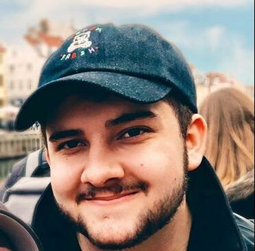

# IASC 2P02
## Hey I'm Devin

I am currently in my Second year at Brock University in the Interactive Arts and Science program. I transferred from Software Engineering at University of Ottawa.

Throughout my studies I’ve completed multiple assignments that I will be adding to my portfolio over the years including homemade projects that I have made in my spare time.

My hobbies include playing and creating music with friends, playing video games and creating digital art.

I am fascinated by animation and digital interactive platforms which is why I chose to continue my studies in Interactive Arts and Science at Brock University

# Blog

## First Blog Post
Ramsay and Drucker’s critique of Moretti is incorrect. They argue that Moretti treats his dataset as given, a priori, and unquestionable, rather than information whose metrics and values are open to question… [continue reading](Blog)
